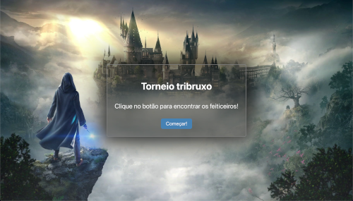
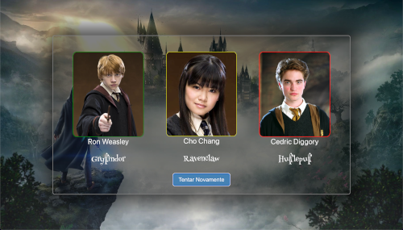

# Harry Potter Triwizard Tournament 

Just a funny aplication where you can try your luck to try catch your favorite Hogwarts characters.
But, now with music!

Vercel deploy link: [https://react-entrega-s1-preparativos-para-o-torneio-tri-wagnerfabricio.vercel.app/](https://react-entrega-s1-preparativos-para-o-torneio-tri-wagnerfabricio.vercel.app/)

<td valign="top" width="33%">

## Images:

</td>

<td valign="top" width="33%">

### Techs:

</td>